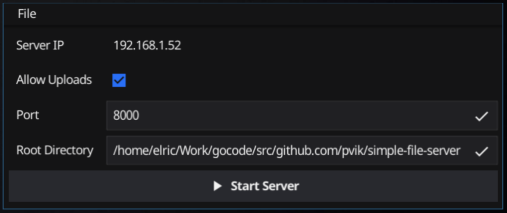

# Simple File Server

A simple file server bundled as a single binary, capable of serving files from any local directory, with an (optional) GUI to control the server.

### Screenshot




###  CLI Usage 

```
Usage of simple-file-server:
  -allowUpload
        allow upload to server
  -cli
        run service in CLI
  -compress
        enable compression
  -logFile string
        log file
  -port int
        port to listen on (default 8000)
  -root string
        root directory to serve files (default spawn directory)
```
